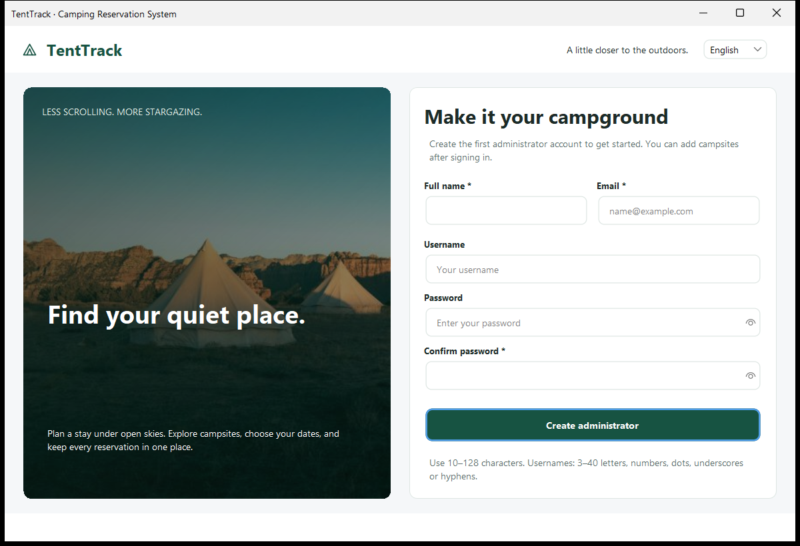
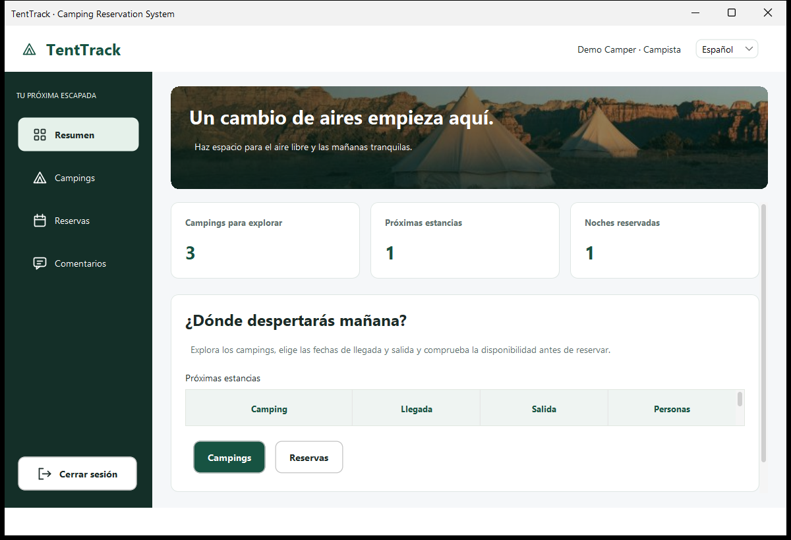
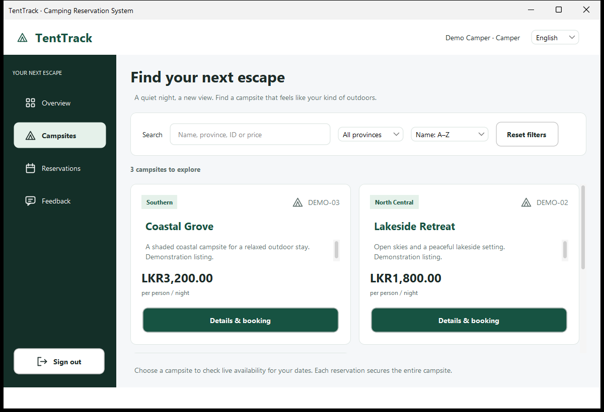
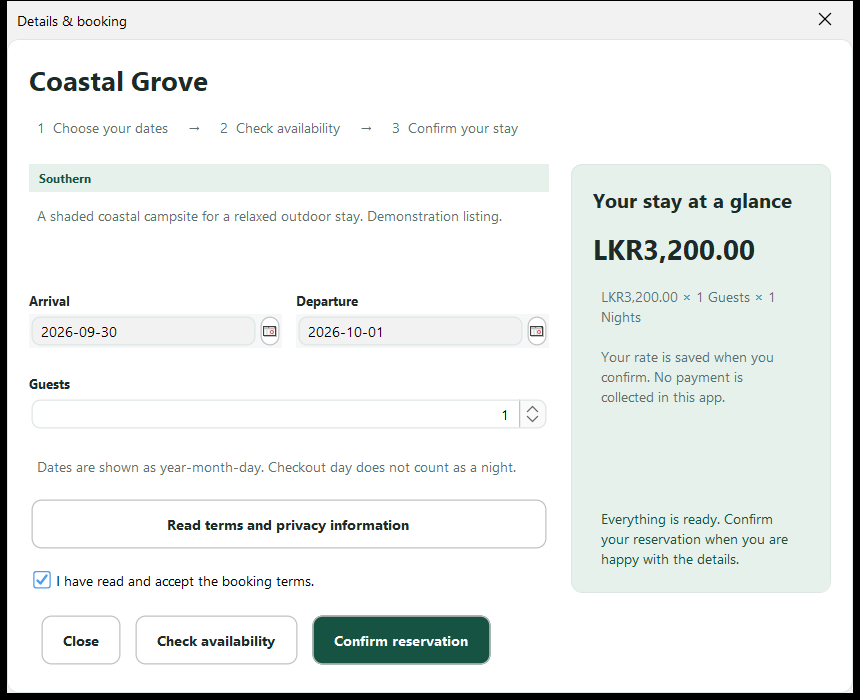
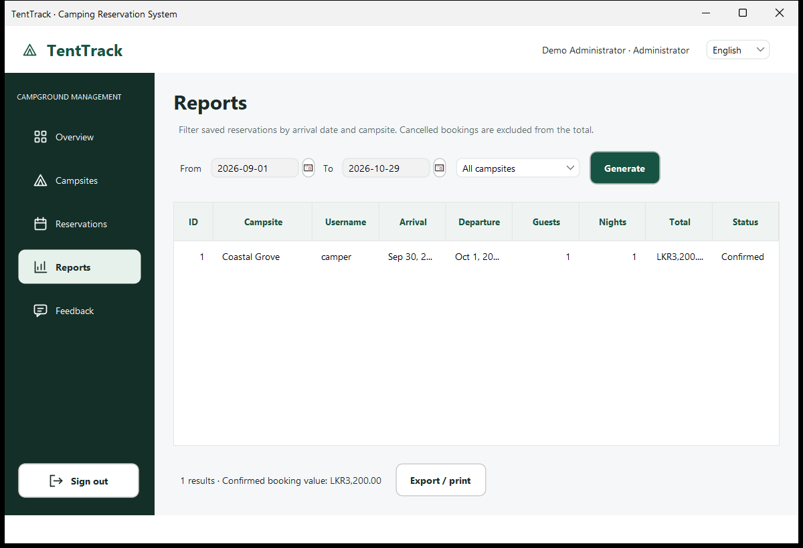

# TentTrack — Camping Reservation System

A Java 21 desktop application for planning camping stays and managing a small campground. This project modernizes the original university Swing application while retaining its campsite search, reservations, billing, reporting, feedback, and English/Spanish workflows.

## Features

**Campers:** account registration and login; search by campsite name, province, ID or price; campsite details; date-based availability; booking estimates and confirmation; personal reservations; eligible cancellations; printable/exportable booking summaries; feedback.

**Administrators:** first-run account setup; a dashboard calculated from saved records; add/edit campsites and rates; archive/reactivate listings; review and cancel reservations; filter reports by arrival range and campsite; view feedback; optionally load fictional sample campsite listings.

Both roles share consistent navigation, FlatLaf styling, accessible form labels, resizable layouts, and English/Spanish language switching. Password hashing and database work run outside Swing's event dispatch thread.

The refreshed interface uses rounded cards, a forest-green sidebar with scalable navigation icons, clearer active-page styling, and larger table rows. Forms focus the first input automatically, while campsite prices and billing units appear on separate lines for easier reading at smaller window sizes.

The customer interface includes campsite cards with instant search, province filters and price sorting, a step-by-step booking dialog with a separate price breakdown, and photo headers using an original project asset. Larger form controls, password reveal, Escape-to-close dialogs and helpful empty states make everyday tasks easier. Admin records remain in sortable tables.

## Stack

Java 21 · Swing · FlatLaf 3.7 · Maven · SQLite JDBC 3.51.2.0 · JCalendar 1.4 · JUnit 5.

No database server or enterprise framework is required. SQLite initializes automatically. Derby and AbsoluteLayout are no longer application dependencies.

## Build and run

Install a **JDK 21** and **Maven 3.9+**. From this directory:

```shell
mvn clean test
mvn package
java -jar target/camping-reservation-1.0.0.jar
```

For development:

```shell
mvn compile exec:java
```

Open this folder as a Maven project in NetBeans, IntelliJ IDEA or VS Code. Run `camp_res_system.Project`. NetBeans's project Run action also uses this entry point. Legacy class launchers, including `lang`, redirect through the same authenticated application.

If Maven reports a local repository under an unwritable location such as `C:\.m2`, correct your Maven configuration or explicitly supply your own cache path:

```powershell
mvn "-Dmaven.repo.local=$env:USERPROFILE\.m2\repository" clean test package
```

### First launch

1. Create the first administrator account. No default passwords or demo user accounts are shipped.
2. Add campsites under **Campsites**, or select **Load sample campsites** for three fictional examples.
3. Sign out and create a customer account to test the camper workflow.
4. Select a campsite, choose dates/guests, check availability, read and accept the terms, and confirm.

Sample listing data lives in `src/main/resources/db/demo-campsites.tsv`; loading it is optional and repeatable. These examples are not real campsite offers.

## Storage and booking rules

The default database is `data/tenttrack.db`, relative to the working directory. To use another location:

```shell
java -Dtenttrack.db=/path/to/tenttrack.db -jar target/camping-reservation-1.0.0.jar
```

Alternatively set `TENTTRACK_DB`. Parent directories are created automatically. A local SQLite file grants the device owner access to data; application roles are not protection against someone directly editing the database. Protect the file and its backups. Shut down all app instances before copying a database backup, including any remaining WAL/SHM companion files.

* Reservations book an entire campsite, preserving the original exclusivity model.
* Arrival is inclusive; departure is exclusive. Back-to-back stays are allowed.
* Arrivals cannot be in the past. Stay length: 1–365 nights. Party size: 1–100 guests.
* Prices are LKR per person per night, stored as integer cents. Nights and totals are calculated from the dates; historical rates are preserved.
* Availability and insertion are serialized in a transaction; database triggers also reject overlap.
* Customers see only their reservations and can cancel before arrival or on arrival day. Administrators can cancel stays that have not ended. Cancelled records remain visible, but no longer block availability or contribute to confirmed booking value.
* Archiving prevents new reservations without deleting existing bookings. Editing a listing can reactivate it.

Reports filter by **arrival date**, inclusive at both filter endpoints. Dashboard and report amounts are **booking value, not collected revenue**. The app does not process payments, taxes or refunds. Print uses the operating system's printer dialog; text export is also available.

## Architecture and project structure

```text
src/main/java/camp_res_system/
  Project.java           application entry point
  config/                SQLite initialization and dependency wiring
  model/                 immutable User, Campsite, Reservation, Feedback records
  repository/            parameterized JDBC and resource management
  service/               session, authentication, authorization, booking rules
  i18n/                  localization and money/date formatting
  ui/                    shared Swing shell, design system, document formatting
src/main/resources/
  db/                    schema and optional demo listings
  i18n/                  English and Spanish text
  images/                packaged original project image
src/test/java/           isolated SQLite and service integration tests
docs/                   audit, schema decisions and verification notes
```

Service boundaries enforce ownership and roles; UI visibility alone does not grant access. Account passwords use salted PBKDF2-HMAC-SHA256 with 600,000 iterations. Username/email uniqueness is enforced by SQLite. Passwords are never logged. SQL lives in repositories/schema resources, not Swing views.

## Tests and screenshots

`mvn clean test` exercises real temporary SQLite databases: authentication, validation, role restrictions, foreign keys, campsite operations, availability, overlaps, concurrent booking, pricing, cancellation, reports, billing, feedback and localization.

The optional desktop smoke test opens windows and captures application-only screenshots:

```shell
mvn -Dtest=UiSmokeTest -Dtenttrack.uiSmoke=true test
```

It requires a graphical desktop. Screenshots are written to `target/screenshots/`. They use temporary test accounts/databases, not your working data.











The screenshots use fictional test data. See [verification notes](docs/VERIFICATION.md) for what was tested and the remaining limits.

## Modernization notes and limitations

See [the audit](docs/AUDIT.md) and [database decisions](docs/DATABASE.md). The user requested SQLite only; no historical database records were supplied or imported.

The original NetBeans Java/form pairs are preserved locally in the ignored `.local-backup/original-project.zip`. The modern views use layout managers rather than generated `.form` editing. Existing workflow entry-point class names remain as launchers; old frame constructors are not a supported external API. Runtime logs are written alongside the configured database in `logs/` and to the console.

This is a local desktop project, not a multi-device booking backend. It has no payment gateway, password-reset email service, capacity-per-pitch inventory, or PDF generator. Campsite names/descriptions are administrator data and are not automatically translated. Large datasets currently load into memory for desktop tables/reports. Printer output depends on an installed printer; no physical print is assumed by automated tests.

The modernization was completed before Git history was created. The local history groups that existing work by dependency and responsibility, using actual commit timestamps; see [history preparation](docs/HISTORY.md). No remote is configured or pushed by this workflow.
